```{r setup, include=FALSE}
knitr::opts_chunk$set(echo = TRUE)
options("couRsework-img_path" = "../../Images/icons") 
### change this if icons local
```

```{r, include = FALSE}
library(tidyverse)
library(couRsework)
library(flair)
```


Welcome!

In this coursework, you'll get set up with the Class Discord, learn about what
is expected of you each week, and hear some tips from me about how to succeed.

```{r, results = "asis", echo = FALSE}
req_vid("Welcome from Dr. B.", type = "Required", url = "https://www.youtube.com/embed/v=zLowv3u2GLs")
```


```{r, results = "asis", echo = FALSE}
make_summary_table(vid_time = "10 min", 
                   reading_time = "15 min", 
                   work_time = "0 min", 
                   num_activities = 2)
```

---

# Using the Class Discord

---

In lieu of an in-person class, we'll be interacting with each other through an
app called **Discord**.  

Discord is a platform for text chatting, voice chatting, and screen sharing.

In particular, course **office hours** are held via Discord.  Your professor will be
available for public questions, or one-on-one and small group chats by text, voice, 
or video.

The office hours for this class are:

### Wednesday and Friday 10am-12pm

I will often be willing to hop on Discord and help out at other times, and I will
answer text chat questions regularly throughout every day!

---

## Join the server


Join the [Stat 331 Server](https://discord.gg/UbXwkxQ) to start experimenting with the interface.

When you join the server, you will be given some suggestions to get started.  

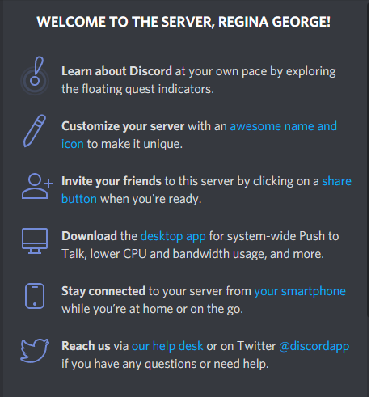


We recommend you click through these - and in particular, it is probably a good idea to download the desktop version of Discord, and perhaps to install it on your phone if you wish.

---

## Set up your account

### Verify your email

To use this Discord server, you **must** have a verified email.  

Nobody (including your professors) will be able to see this email, and it does 
not have to be your Cal Poly email.  This is simply to keep the server from being 
overrun by temporary accounts.


### Create your identity

The first thing you should do is decide what name and picture you would like to use.


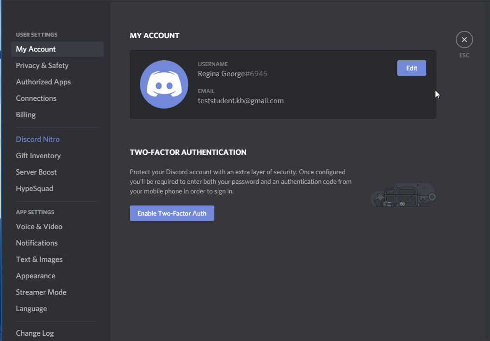

We would like to **strongly** encourage you to use your **real name and picture**, 
so that we can get to know you.  However, if you prefer to remain anonymous, 
you are free to do so.

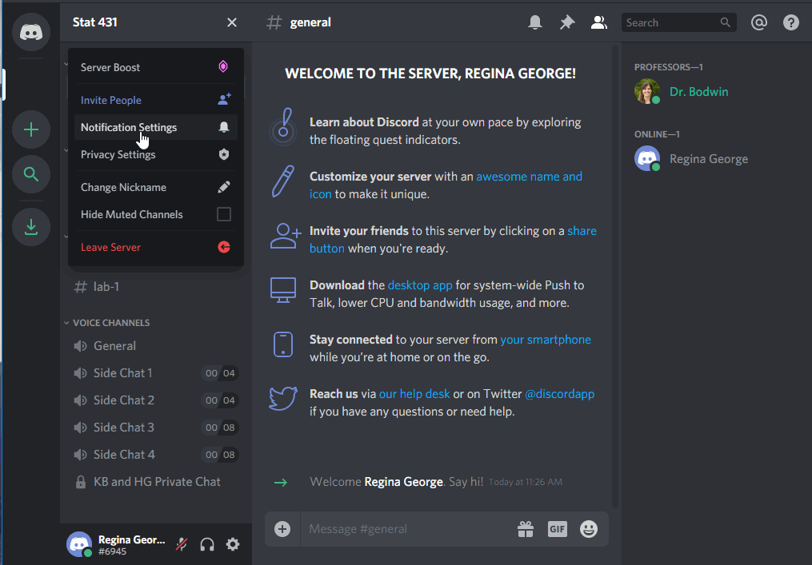


(Please do not be like Regina and use the name of another student, however!  
This kind of impersonation will result in a permanent ban from the server.)


### Decide about privacy and notifications

The default settings on the channel are probably just fine for you.  
Feel free to make any changes that work for you, though.

You can change your message notifications:

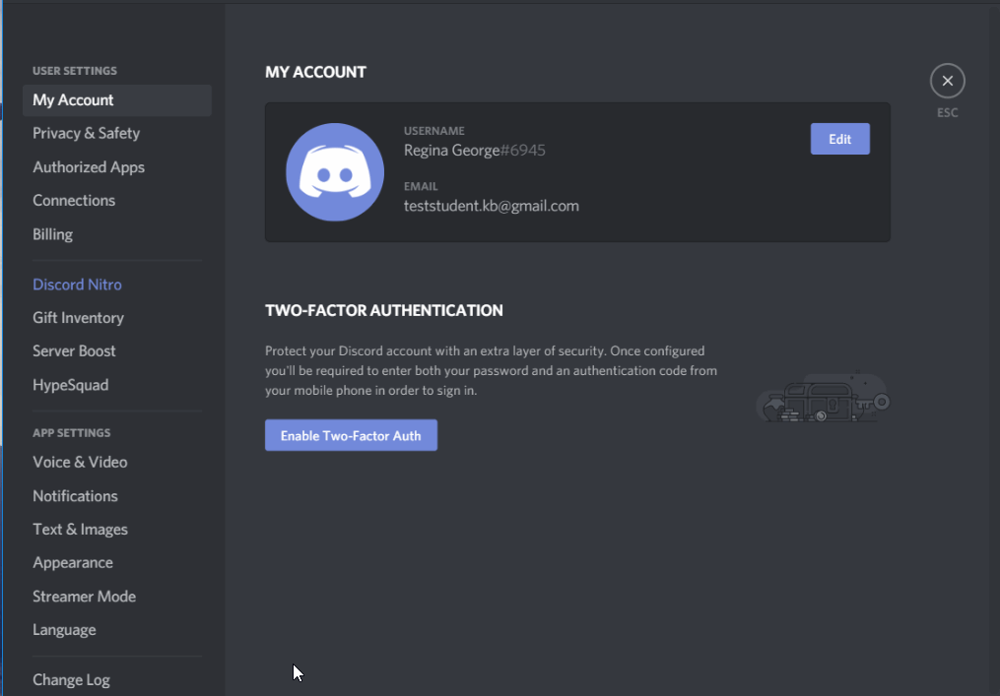


You can edit your privacy settings, although most things are already private:

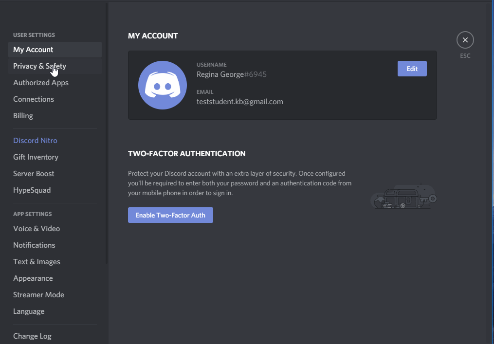

### Connect other apps

You can connect other apps to Discord, either for productivity or just for fun.

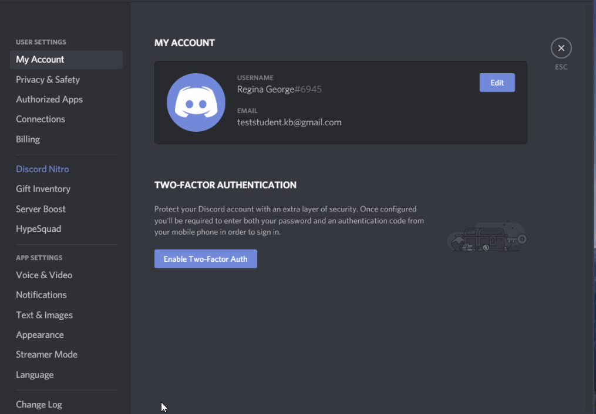


I have connected my Spotify, so you can listen along with my music and/or judge my taste.


---

## Using the Channels

The server is made up of many channels.  Some are text chatrooms, while some are "Voice Channels" that connect you via audio to everyone else in the channel.


### Text Channels

Use the `#general` channel for anything and everything:

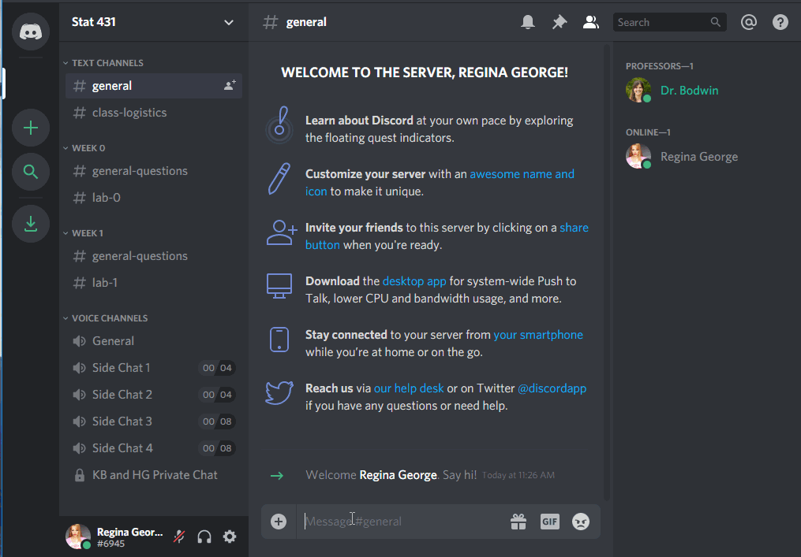

If your question is about course logistics, rather than the material itself, consider using the `#class-logistics` channel:

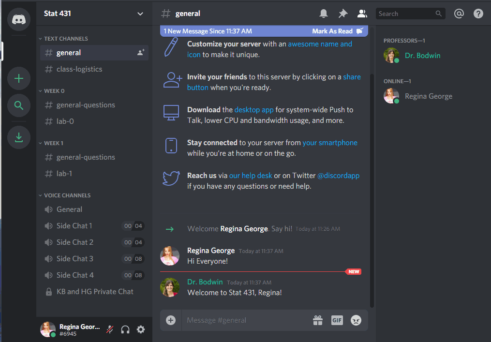


You can use the specific weekly channels to ask questions about the material...

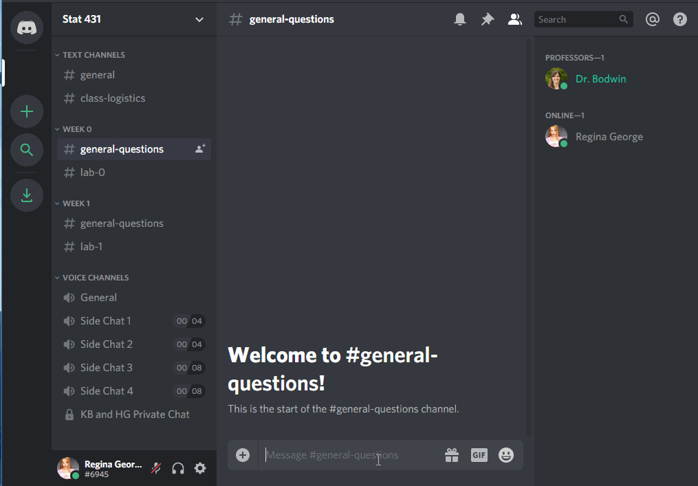

... or the specific lab assignment.


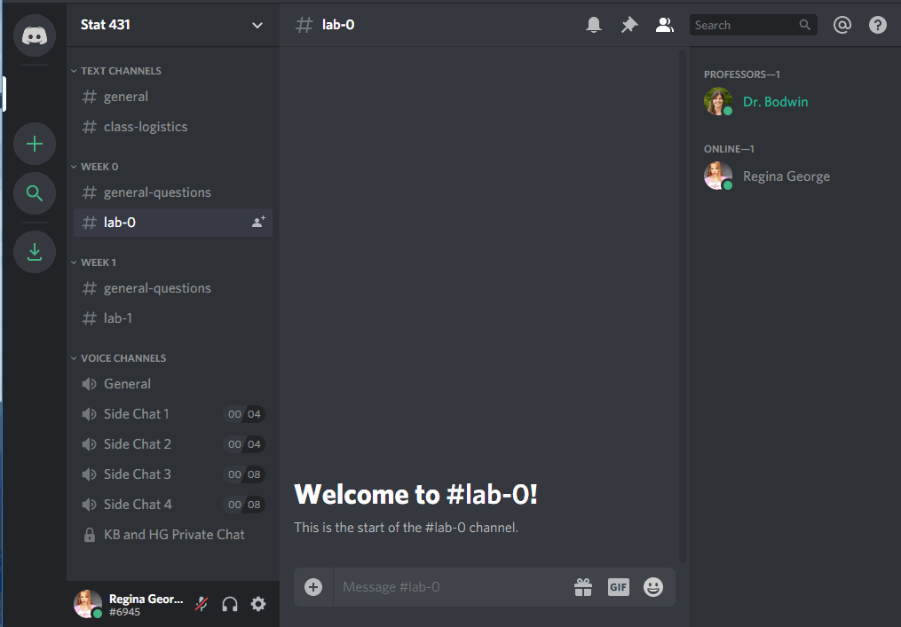

Notice that you can use tick marks (` ``` `), like in R Markdown, to make your code appear in a formatted code box.


### Voice Channels

To join a voice channel, simply click it!  Make sure you are careful about when you are muted or unmuted.

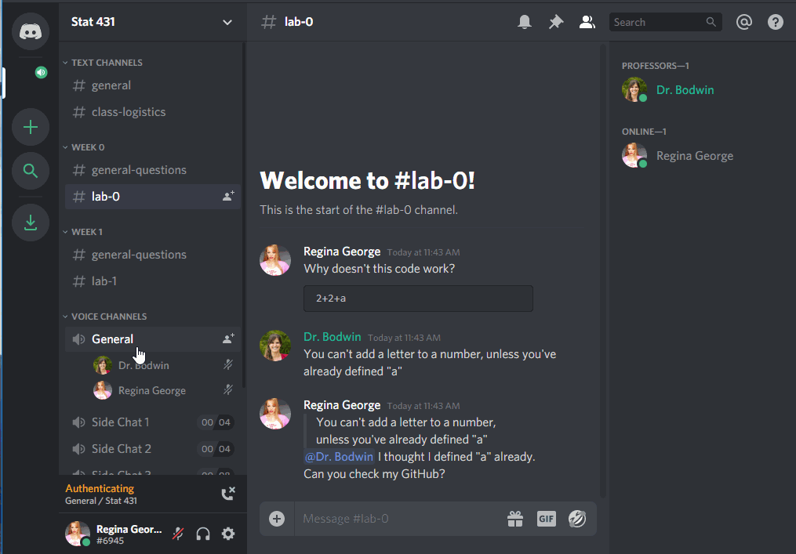

The extra "Side Chat" channels are limited to 4 or 8 people, if you would like to start an impromptu study conversation without being heard by the professors and/or the rest of the class.  (We'll only drop in if you invite us!)

Voice channels can also be used for people to "Go Live", and share their screen with everyone else.

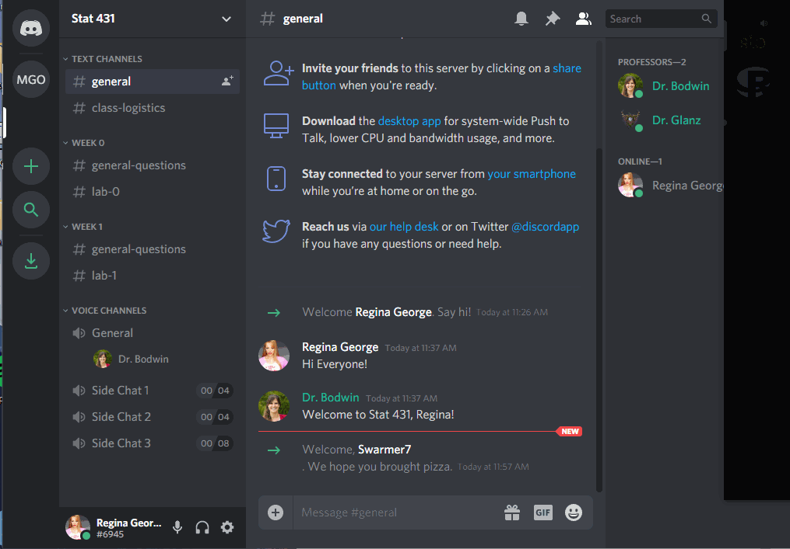

While this will usually be something professors use to demonstrate code, you can go live, too!  But you may need to download the desktop version of Discord to do so.


### Private messages

It is also easy to send private messages, to your professor(s) or to each other.  These private messages can also easily be used to launch a private video chat and/or screen sharing.


---

## Creating your own server

Last but not least - if you have an established study group you like to work with, and you want to use Discord to communicate without the distraction or invasion of the rest of the class, feel free to create your very own server!  You can easily hop between servers during work parties, to ask each other questions or just to take a break and chat about life.


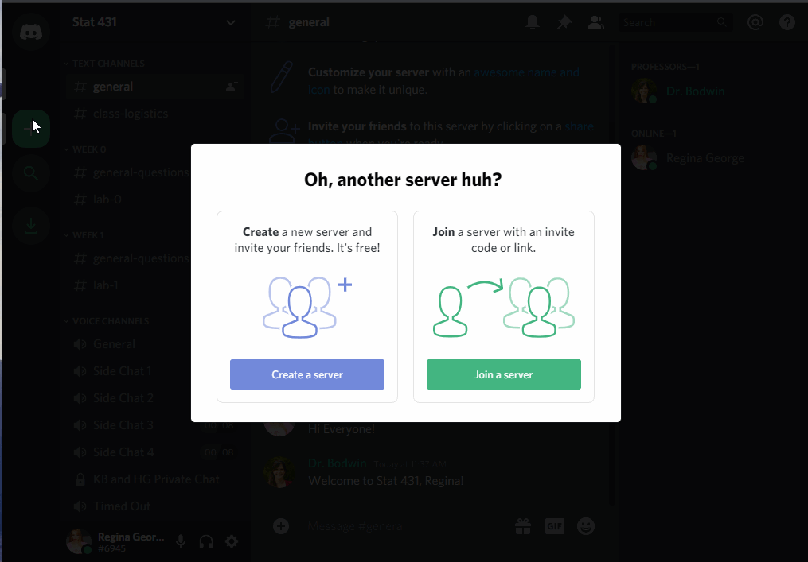


---

## See you at the Party!


---

```{r, results = "asis", echo = FALSE}
checkin("Discord Server")
```

Introduce yourself in the "Introductions" channel of the Discord Server.

---

# Course Structure

---

```{r, results = "asis", echo = FALSE}
req_vid("Class Structure", type = "Required", url = "https://www.youtube.com/embed/v=naPSsxgiTPo")
```

---

## What your typical week will look like

### Coursework

Each week, you will be expected to work through a sequence of readings, videos, and check-ins. 
(Much like this one!)
These are meant to replace the in-class lecture experience; thus, you should plan 
to devote about 1-3 hours a week to this Coursework. 


### Practice Activities

*Due Wednesdays at midnight*

As part of your "in-class" style work, you will also have short practice tasks to complete, to tie together the material.  You should plan for these to take you 1-3 hours per week.

These are meant to replace the in-class group work experience; as such, you are strongly encouraged to work on these in groups.


### Lab Assignments

*Due Fridays at midnight*

Aside from the Final Project and Exams, the majority of your grade in this class 
comes from Lab Assignments.  You should plan to spend a large amount of time 
outside of class (5-10 hours each week) completing your Lab Assignment.

Lab work is **individual**.  Although you may discuss ideas with your classmates 
and seek help from the usual sources, all code and text **absolutely must** be your own.  

Labs will be submitted on Canvas.


### Peer Review

*Due Sundays at midnight*

As part of your Lab Assignment grade, you will also be asked to review and rate your classmates' work.  This will be done on Canvas, and a rubric will be supplied for you.


### Challenge

*Due Sundays at midnight*

Each week, your Lab Assignment will have an optional challenge, which will require
you to learn and use skills beyond what is covered in the assignment. These 
challenges are worth 5% of your overall grade.

Challenges are worth 10 points each, and you earn these points simply by making
a good faith attempt.  Thus, **everyone** should receive at least an 80/100  
(10 points times 8 labs) in this category.  

I will also award bonus points for particularly impressive submissions, which
could allow you to skip challenges, or to go over 100% and receive extra credit!

---

```{r, results = "asis", echo = FALSE}
checkin("Syllabus")
```

**Question 1:** What percent of your grade are Lab Assignments worth?  When are
they due?

**Question 2:** If you complete ALL the Challenges, but you do not earn bonus
points on any of them, what will be your grade in this category?

**Question 3:** What day is the midterm exam?

**Question 4:** You have finished the week's Practice Assignment, and you want to
know if you did it right.  You ask your friend, and she says, "Oh, I got *Luke Skywalker*
as my answer."  Have you violated Academic Honesty policies?

**Question 5:** You and a friend have been working on Lab 1 together.  You finish
up and want to go to bed, but she is still a little confused.  You email her your
file, and say, "Don't copy this, just look how I did it so you can figure it out."
Have you violated Academic Honesty policies?

---

# What to do when you have questions

---

Stuck on something, or have a logistical question about the course?  
Follow these easy steps to success!

## Make sure your question isn't already answered somewhere.

#### Double-check the syllabus.


#### Double-check the instructions for the assignment.

Remember that most details will appear in the Coursework pages or in the Lab Assignment instructions - not in the submission links on Canvas.

#### Double-check the Announcements

On the "Account" section of Canvas, under "Notifications", make sure your preferences are updated for Announcements.  We recommend opting to receive an email any time an announcement is posted.


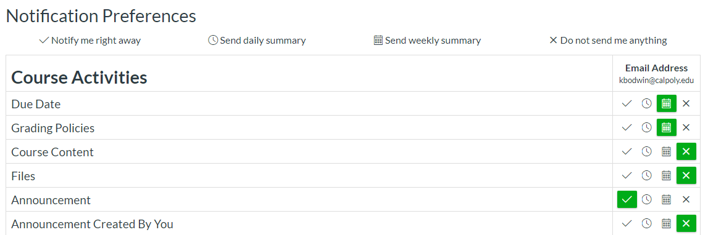

---


## Ask your question on Discord

If you post your question to a text channel, you will probably get a fast response
from a classmate.  If not, you will get a response from me within 24 hours.

---


## Send a message via Canvas

If your question is private, you may message me directly via Canvas.

To do so, find the "Inbox" section, and click "compose a new message".

**Note:** Although I *will* answer emails, I strongly prefer Canvas messages.


---


# Tips for succeeding in this class:

---

## Take the Coursework pages as seriously as you take in-person lecture.


With this class being online and asynchronous, there will likely be a temptation 
to skip things, multitask, and cut corners.  

We want to encourage you to commit to giving the Coursework segments the same 
level of attention that you would ordinarily give to in-class lecture.  
Put the same effort into the Check-In Activities that you would if you were 
sitting in a classroom.


In return for your efforts, I promise to choose requiredvideos and readings 
carefully, so that we do not waste your time. 

---

## Google is your friend.

The R community has an enormous aresenal of online learning resources.  I've
linked a few on the class Canvas, but you can always find more!


Learn to Google for tutorials and examples; to use [Stack Overflow](https://stackoverflow.com/); to ask questions on Twitter; and to otherwise make good use of the vast and welcoming R network on the internet.

---

##  Find ways to work together.

While much of this course is identical to the in-person version, it is impossible 
to fully replicate the experience of working together on a coding task in person.

We encourage you to establish Study Buddies and/or Study Groups early in the quarter, 
even if you don't know anyone yet.  

The class Discord server is a great way to get started.  We also hope you will be proactive about setting up your own video chat sessions, phone calls, Google Docs, group chats, etc.  (How many different platforms can you talk about Stat 331 on?  Facebook? Snapchat?  Instagram?  TikTok?  Bumble???)

I hope that we will all be purposeful and creative about finding ways to work as a team.


