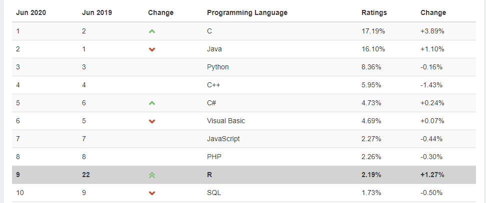

```{r setup, include=FALSE}
options(htmltools.dir.version = FALSE)
library(tidyverse)
```

```{r xaringan-themer, include=FALSE}
library(xaringanthemer)
solarized_light()
```

class: center, middle

# What is R?

---
# What is R?

**R** is a programming language designed originally for *statistical analyses*.

--

**R** was created by **Ross Ihaka** and **Robert Gentleman** in 1993.

_(Their names are why it's called **R**, which is also a joke about the predecessor
being called **S**.)_

--

**R** was formally released by the **R Core Group** in 1997.

[https://www.r-project.org/contributors.html](https://www.r-project.org/contributors.html)


This group of 20-ish volunteers are the *only* people who can change the **base** 
(built-in) functionality of **R**.

---
# R is popular and growing!



---
# Strengths


**R**'s **strengths** are...

--

... handling data with lots of **different types** of variables.

--

... making nice and complex data **visualizations**.

--

... having cutting-edge statistical **methods** available to users.

---
# Weaknesses

**R**'s **weaknesses** are...

--

... performing non-analysis programming tasks, like website creation. 

(*python*, *ruby*, ...)


--

... hyper-efficient numerical computation. 

(*matlab*, *C*, ...)

--

... being a simple tool for all audiences 

(*SPSS*, *STATA*, *JMP*, *minitab*, ...)

---
class: center, middle, invert

# But wait!


---
# Packages

The heart and soul of **R** is **packages**.

--

These are "extra" sets of code that add **new functionality** to R when installed.

--

"Official" **R** packages live on the *Comprehensive R Archive 
Network*, or **CRAN**

--

But anyone can write and share new code in "package form" (more later)

---

# Open-Source

Importantly, **R** is *open-source*.

--

There is no company that owns **R**, like there is for *SAS* or *Matlab*.

(*Python* is also open-source!)

--

This means nobody can sell their **R** code!

--

* (but you can sell "helpers" like **RStudio**)

--

* (and you can keep code **private** within an organization or company)

--

**Packages are created by users like you and me!**

---
# Open Source

Being a good open-source citizen means...

--

... **sharing** your code publicly when possible. 

(later in this course, we'll learn about *GitHub*!)

--

... **contributing** to public projects and packages, as you are able.

--

... creating your own **packages**, if you can.

--

... using **R** for **ethical and respectful** projects.

---

class: center, middle

# Let's try it!

---

class: center, middle, inverse

# Intro to RStudio

---

class: center, middle

# What is RStudio?

---
# What is RStudio?

**RStudio** is an IDE (*Integrated Developer Environment*).

This means it is an application that makes it easier for you to interact with **R**.

--


---
# History of RStudio

**RStudio** was released in 2011 by J.J. Allaire.

--

In 2014, RStudio hired *Hadley Wickham* as Chief Data Scientist.  They now employ around 20 full-time developers.

--

Recall: You can __not__ sell __R__ code; packages created by RStudio's team are freely available.  

They make money off the IDE and other helper software.

--

In 2020, RStudio became a PBC (*Public Benefit Corp*), meaning they are legally obligated to support education and open-source development.

---


---
class: center, middle

# Let's try it!

---
class: center, middle, inverse

# Intro to R Markdown

---

# What is Markdown?

**Markdown** (without the "R") is a *markup language*.  This means special symbols and formatting to pretty documents.

--

Markdown files have the **.md** extension.

---


---
# What is R Markdown?

**R Markdown** (with the "R") uses regular markdown, plus it can run and display **R** code.  (Other languages, too!)

--

R Markdown files have the **.Rmd** extension.

---


---


---
# Knitting

To convert your R Markdown file to a beautiful document, click **Knit**.


---
# Knitting

You do **not** have to knit a file to *save* it!!!

Do this the regular way:

- `Ctrl/Cmd + S`

- Click the Floppy Disk icon

- Click "File > Save As"

--

As you work, you should **save** extremely frequently and **knit** semi-regularly.

---
# Knitting

When you click **knit**, here is what happens:

--

- Your file is saved.

--

- The R code written in your *.Rmd* file gets run.

    + Any code you ran already doesn't "count"; we start from scratch.
    + The code is run *in order*.

--

- A new file is created.

    + If your R Markdown file is called "Lab1.Rmd", then a file called "Lab1.html" will be created.
    + This will save in the same folder as "Lab1.Rmd".
    
---

class: center, middle, invert

# Let's try it!
